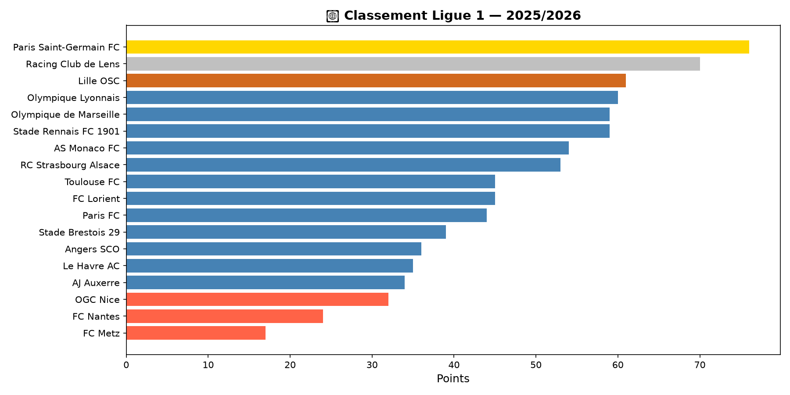
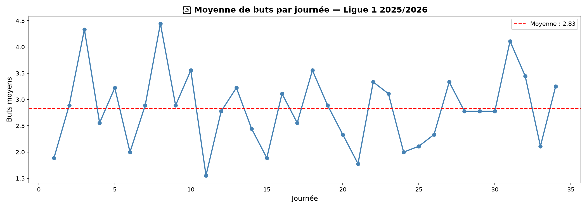
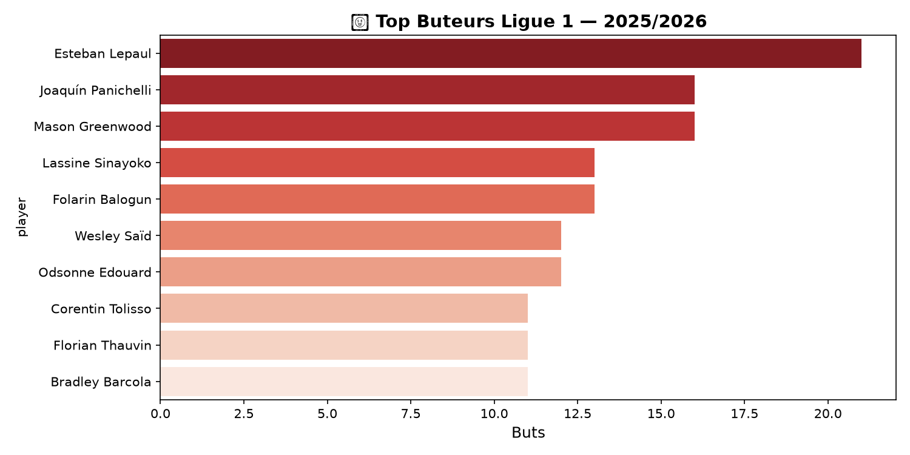
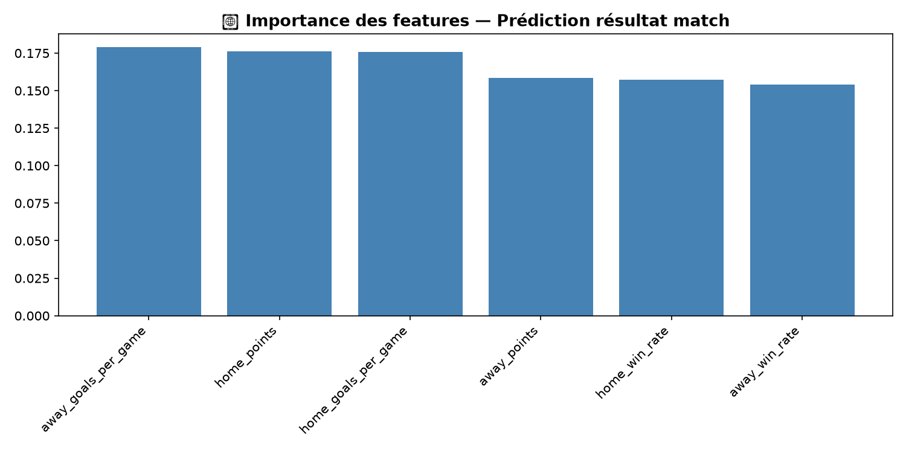

# ⚽ Football Analytics Pipeline

> Pipeline ETL complet + modèle de Machine Learning pour analyser et prédire les résultats de la Ligue 1 2025/2026.

## 🏗️ Architecture
API Football-Data.org

↓

Extract (requests)

↓

Transform (Pandas)

↓

Load (PostgreSQL)

↓

Analyse (matplotlib/seaborn)

↓

ML (scikit-learn / Random Forest)

## 📊 Visualisations

| Classement Ligue 1 | Buts par journée | Top Buteurs |
|---|---|---|
|  |  |  |

## 🤖 Modèle ML — Prédiction de résultats

- **Algorithme :** Random Forest Classifier (scikit-learn)
- **Features :** win_rate, goals_per_game, points (domicile & extérieur)
- **Accuracy : 48%** — cohérent avec la littérature sur la prédiction de matchs de football
- **Dataset :** 305 matchs terminés, saison 2025/2026



## 🛠️ Stack technique

| Couche | Technologie |
|---|---|
| Extraction | Python · requests · API REST |
| Transformation | Pandas |
| Stockage | PostgreSQL · psycopg2 |
| Analyse | matplotlib · seaborn |
| Machine Learning | scikit-learn (Random Forest) |
| Environnement | python-dotenv · Git |

## 🚀 Lancer le projet

**1. Cloner le repo**
```bash
git clone https://github.com/SaidOueslati/football-analytics.git
cd football-analytics
```

**2. Installer les dépendances**
```bash
pip install -r requirements.txt
```

**3. Configurer les variables d'environnement**
```bash
cp .env.example .env
# Remplir API_KEY et credentials PostgreSQL
```

**4. Lancer le pipeline ETL**
```bash
python main.py
```

**5. Lancer le modèle ML**
```bash
python -m ml.predict
```

## 📁 Structure du projet
football-analytics/
├── extract/        # Appels API football-data.org
├── transform/      # Nettoyage et enrichissement Pandas
├── load/           # Chargement PostgreSQL
├── analysis/       # Visualisations matplotlib/seaborn
├── ml/             # Modèle Random Forest
├── sql/            # Schéma de la base de données
└── main.py         # Point d'entrée du pipeline ETL

## 👤 Auteur

**Said Oueslati** — L3 Informatique, Université Paris Cité  
[LinkedIn](https://www.linkedin.com/in/said-oueslati-9432a2208/) · [GitHub](https://github.com/SaidOueslati)